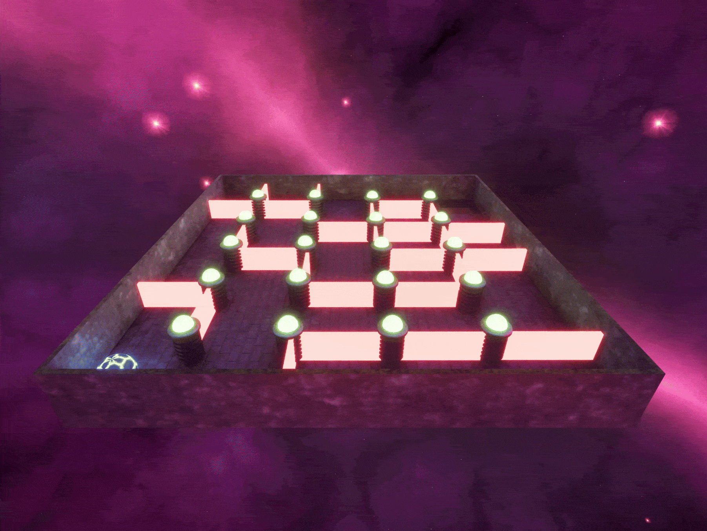

# Marble Run

**Marble Run** is my first game project, where the goal is to get the ball into the hole on the other side of the room.

This is part of my journey learning **Unreal Engine 5**, with a particular focus on learning and experimenting with **Blueprints** and **3D Modelling**.

## Planned Improvements

A list of improvements I'm currently working on:

- Implement a simple UI for starting and quitting the game
- Show elapsed time on the HUD
- Add more levels
- Improve ball and peg collision

## Known Issues

- Collisions are a bit inconsistent right now; sometimes the ball can clip through the floor
- The pegs can bounce the ball outside of the playable area
- If the ball falls off the map, the game does not currently end

## Built With

- **Unreal Engine 5**
- **Blueprints**
---

This project is part of my journey into game development and learning Unreal Engine.
